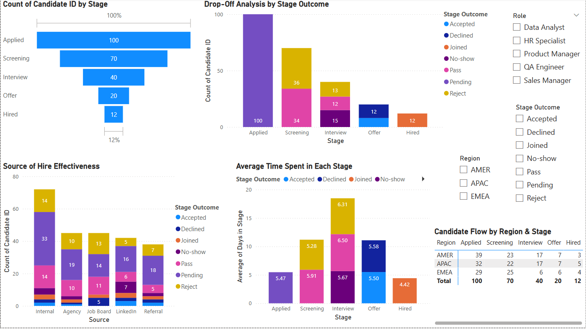

A data-driven dashboard built in Power BI to visualize the recruitment pipeline, stage drop-offs, source effectiveness, and time-to-hire metrics. This project simulates how recruitment analytics can help optimize hiring decisions and candidate engagement across regions.

---

## 🎯 Objective

To monitor and improve the recruitment process by:
- Tracking candidate flow across hiring stages
- Identifying major drop-off points
- Evaluating source effectiveness
- Measuring time spent at each stage
- Comparing regional performance

---

## 📁 Dataset

- **File:** `realistic_recruitment_funnel_data.xlsx`
- **Size:** 100 mock candidate records
- **Fields:** Candidate ID, Role, Source, Stage, Stage Outcome, Days in Stage, Region

---

## 📊 Power BI Dashboard Includes:

- **Recruitment Funnel:** Visualizing candidate progression from Applied → Hired
- **Drop-Off Analysis:** Stage-wise breakdown of rejections, no-shows, and declines
- **Source Effectiveness:** Comparing conversion quality across LinkedIn, Referrals, etc.
- **Time in Stage:** Identifying bottlenecks via average duration per stage
- **Regional Matrix:** Distribution of candidates across stages in EMEA, AMER, and APAC

---

## 🧠 Key Insights

- **Interview** stage had the highest drop-offs due to no-shows and rejections
- **Internal and Referral** sources had higher offer-to-hire ratios than external platforms
- **Screening** took the longest time per candidate, suggesting a process improvement opportunity
- **EMEA** had the most efficient funnel from Screening to Hire
- A total of **100 unique candidates** were analyzed (some visuals aggregate stage entries – not unique headcount)

---

## 🛠 Tools Used

- Power BI
- Excel
- DAX
- Data modeling and visualization

---

## 📸 Dashboard Preview

